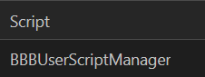
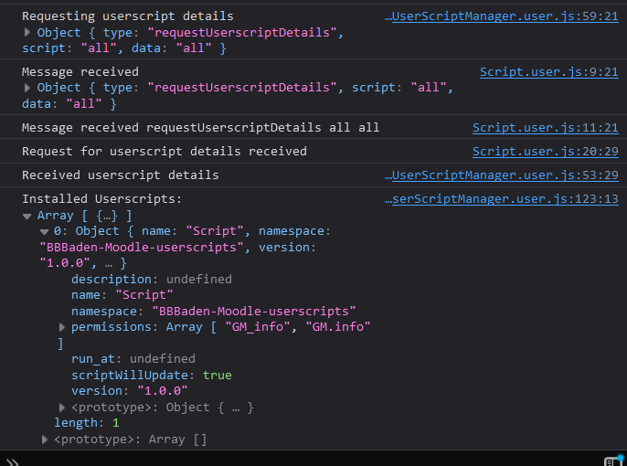

# BBBUserScriptManager (WIP)

**! Make sure the scripts are in the correct order !**




## Console



## Adding support to your own scripts

If you want to BBBUserScriptManager to support your own scripts, you can do so easily by adding a few lines of code to your script. Here is an example of how you can add support to your script:

[Take a look at the example script](script.user.js)


Add the following lines to the metadata (`// ==UserScript==`) block of your script:

```javascript
// @grant        GM_info
// @note         MODULES: [bridge.lib.js]
// @require      https://github.com/BBBaden-Moodle-userscripts/BBBUserScriptManager/raw/main/bridge.lib.js
```

and add the following line to the end of your script:

```javascript
const connection = new Script();
```
